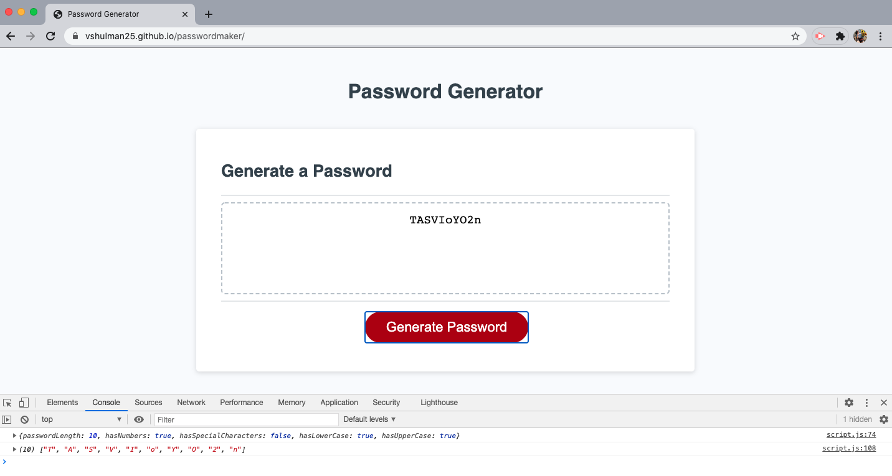
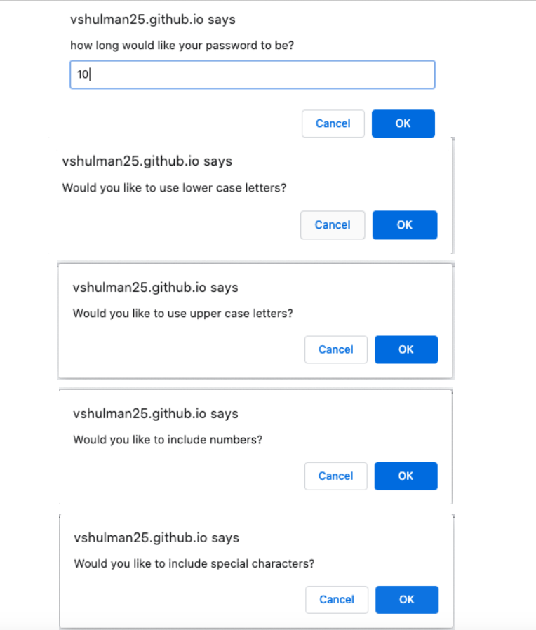

# 03 JavaScript: Password Generator
---

## Description 

For this weeks assignment, I was tasked with creating a password generator for employees in hopes of protecting sensitive information. Employees can  select their preferences and a random password will be displayed on the screen once they have completed the prompts. The only criteria that must be met regards the password being 8 characters and less than 128. Aside from that users were free to select if they wanted to use numbers, uppercase, lowercase and/or special characters. They do have the ability to combine all of these. When the console log is shown, user choices are logged and displayed. 

---

## Installation 

Use preferred code reader and browser to view HTML, JS CSS & README files.

--- 

## Preview 

---

## Live Link 

https://vshulman25.github.io/passwordmaker/

---

## Credits

Developer - Victoria Shulman 